### 作业配置

> 这部分主要介绍作业配置(更新中)，作业配置后续将会支持众多作业配置，目前只支持发布相关的配置；


**发布配置**

> 预先配置你发布的应用信息，如：环境、主机、Git库等，


例举例一个简单发布示例：

- ①创建命令
- ②配置模板
- ③配置仓库
- ④新建应用
- ⑤提交发布

**创建命令**

> 我们提供了基于`服务器`和`Bucket`基础发布脚本示例供你使用.

克隆代码
```shell
##将代码放到/opt/ops_scripts目录下，后续平台要使用到
mkdir -p /opt/ops_scripts
cd /opt/ops_scripts && git clone https://github.com/opendevops-cn/codo-publish.git
cd codo-publish && pip3 install -r requirements.txt

##修改对应settings里面API网关地址，用户密码信息
vim settings.py
api_gw = 'gw.opendevops.cn'
```


接着到平台添加命令，点开`任务模块`-`命令管理`

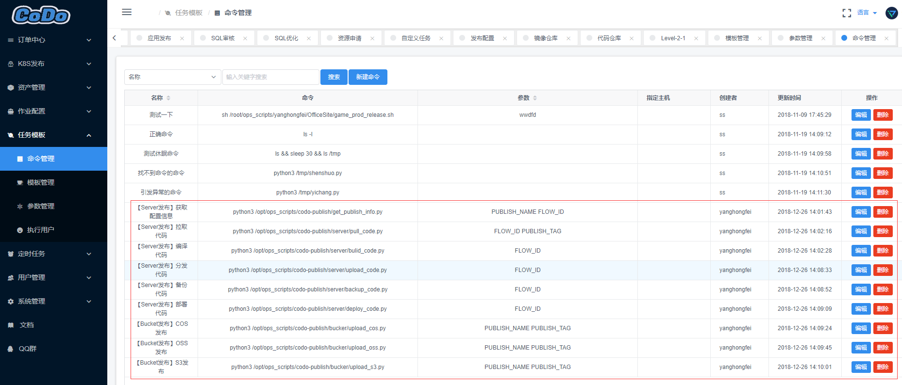

**配置模板**
点开`任务模块`-`模板管理`


> 这里需要你创建一个模板，如：Server发布示例，添加你的命令，自由排版，模板管理文档参考：[任务模板](http://docs.opendevops.cn/zh/latest/task_template.html#)

- 组：1的为第一组
- 优先级： 按数字顺序执行
- 参数：PUBLISH_NAME和FLOW_ID都是系统变量，不要修改
- 执行用户： 默认127.0.0.1可不选，保持默认即可
- 触发器：这里支持定时支持、人工干预、直接执行，默认是直接执行

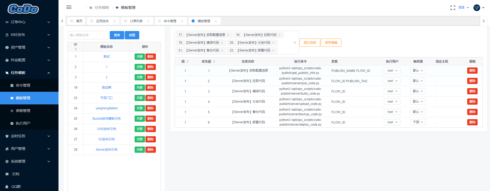


**配置代码仓库**

点开`作业配置`-`代码仓库`

> 这里需要你配置一个git仓库地址，要发布的代码仓库。


**新建应用**
点开`作业配置`-`发布配置`
- 发布应用：建议一个有意义的名称
- 发布类型：选择发布类型，支持(服务器、存储桶、K8S CD)
- 构建主机：哪台主机执行操作，默认（127.0.0.1）
- 代码仓库：下拉选择你的代码库
- 关联模板：下拉选择你要关联的模板
- 排除文件：exclude排除，如图，多个按行隔开
- 发布类型：目前只支持简单发布
- 目标主机：ip port user password格式，多个按行隔开
- 目标主机组：CMDB里面API主机组的信息，可通过CMDB组里面点击获取API地址
- 发布目录: 服务器的代码目录如：/var/wwww/yanghongfei/


**提交发布**
> 最后提交发布，发布是基于git tag的，需要你在要发布的版本库上打上tag

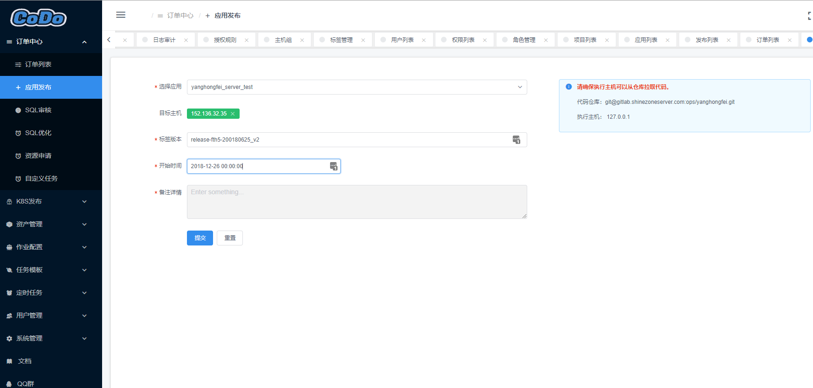

提交发布后会在订单列表里面显示出来你将要执行的任务，
当你点击到这个任务的时候，我们会把任务信息给展示出来方便你来确认，最后需要你进行审批，可选择时间执行。

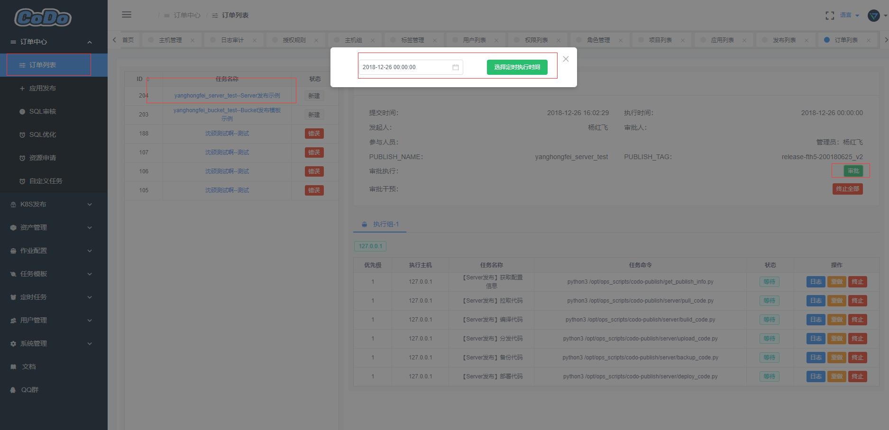

如下图示例有一个手工干预的，需要你点击终止全部旁边的干预名称进行执行。

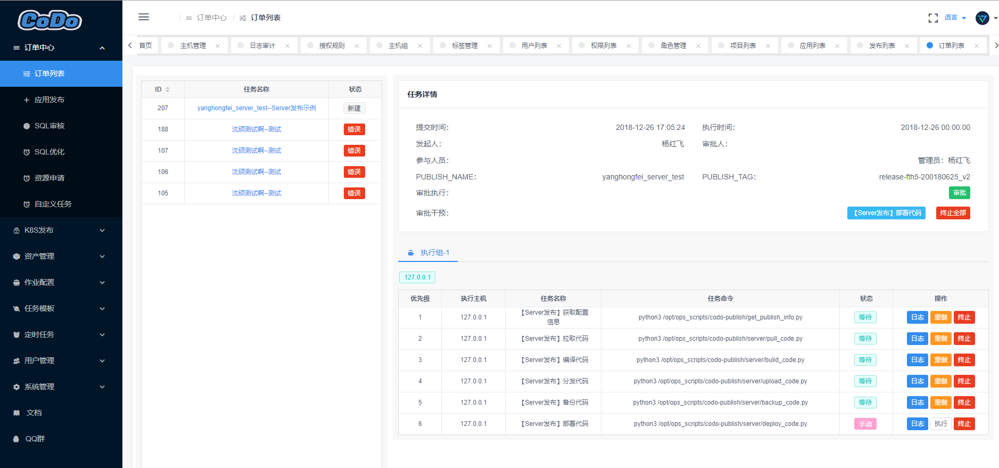

点击完审批后会进入等待执行，随后会按照你模板里面的顺序进行执行

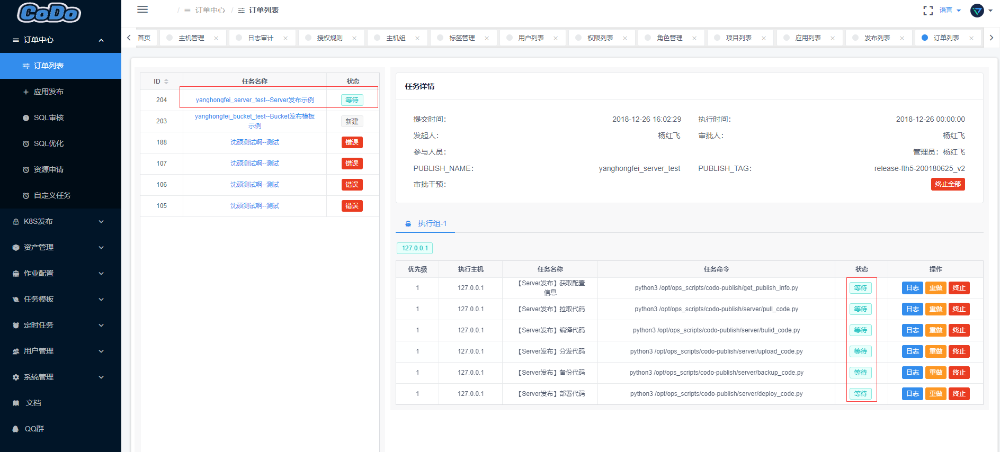
最后执行完成后会显示状态OK，
- 若执行途中有报错，会暂停任务，可根据`日志`进行排错，进行`重做`
- 若执行途中有报错，且你不希望本组服务器进行执行了，可以点击`终止`
- 若整个任务都不想要了，可以点击`终止全部`

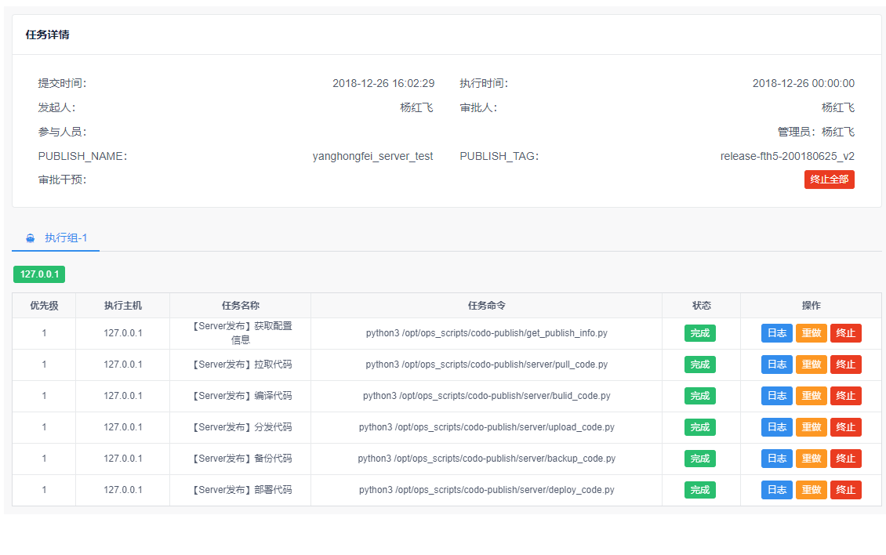

**标签树**

> 预先配置好你要管理的主机和数据库，然后新建一个标签，将统一管理的主机和数据库规划在一个标签下，便于统一管理和操作。

列举一个简单创建标签的示例：

- ①新建标签
- ②新建server
- ③新建DB

**新建标签**

点开`标签树`-`root`-`新建标签`

- 标签名称：建议取一个简单明了的名字
- 主机：下拉选择已创建的管理主机或者不填写，在后续创建server的时候也可关联该标签
- 数据库：下拉选择已创建的数据库或者不填写，在后续创建DB的时候也可关联该标签
- 代理：因为大部分线上DB或者Redis都没有外网，下拉选择已创建的代理主机或者后续创建DB时候也可关联
- 授权用户：下拉授权用于操作该标签的用户

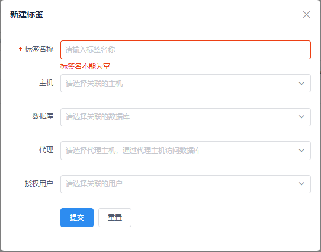

**新建server**

点开`标签树`-`server`-`添加主机`

- 主机名称：建议取一个有特定意义的名字
- IP地址：填写要管理的服务器IP地址
- 区域：服务器的所在区域，例如(上海，新加坡等)
- 标签：下拉选择上面创建的标签或者其他已有标签
- 备注：记录其他你需要标识的文字

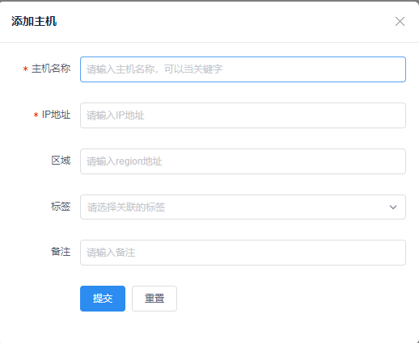

**新建DB**

点开`标签树`-`DB`-`添加数据库`

- 数据库名称：填写你要操作的数据库名字也可以是自定义的名字
- 数据库地址：输入被管理数据库地址
- 数据库端口：数据库连接端口(默认为3306)
- 用户：对该数据库有操作权限的账号
- 密码：上面账号对应的密码
- 环境：下拉选择你要对应的环境
- 代理：下拉选择可以外网连接到该数据库的代理地址
- 类型：下拉选择你的数据库类型
- 标记：下拉选择该数据库的操作权限
- 标签：下来选择对应的管理标签
- 备注：记录其他你需要标识的文字

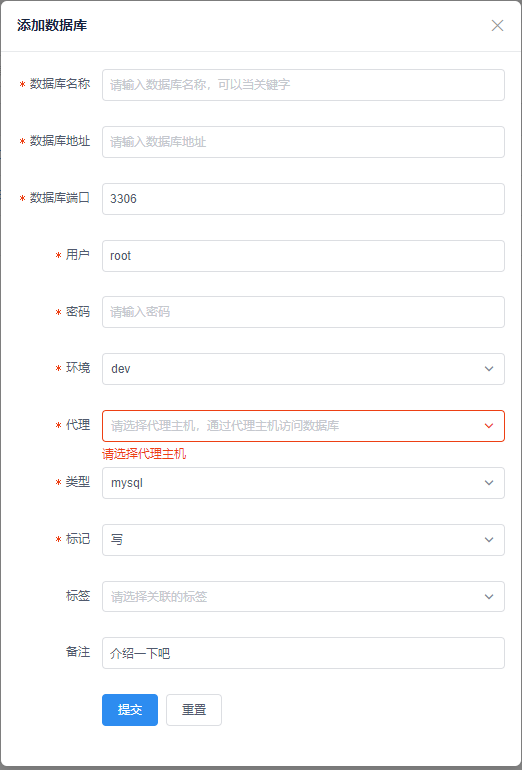

**代理配置**

>预先配置好代理服务器地址，用于创建标签树下DB时可供选取，该代理是用来连接无外网状态下的数据库而存在的。

列举一个简单创建代理的示例：

- ①添加代理
- ②编辑inception
- ③编辑salt

**添加代理**

点开`代理配置`-`添加代理`

- 代理主机：填写你要用来代理连接数据库的IP地址
- 备注信息：填写描述信息


**编辑inception**

点开`代理配置`-`选择对应的inception编辑`

- Inception主机：填写Inception服务的IP地址
- Inception端口：填写Inception服务端口
- 备份库主机：填写可以代理连接数据库的IP地址
- 备份库端口：填写端口(默认3306)
- 备份库用户：填写可操作备份的账号
- 备份库密码：填写对应账号密码

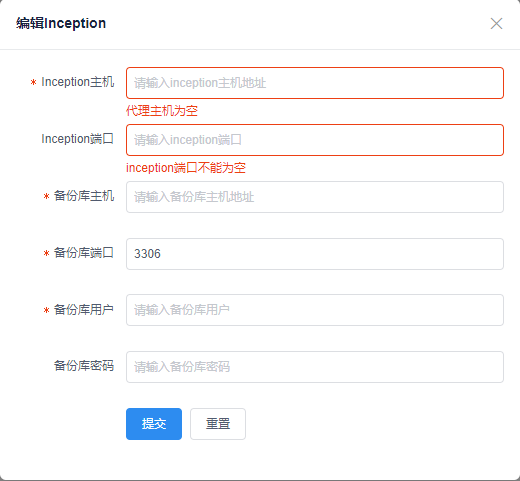

**编辑salt**

>该字段为保留字段，用于后期开发处理


> PS: 作业配置和任务模板编排作业任务，稍有点复杂，我们正在不断优化系统和文档，感谢你的支持。

